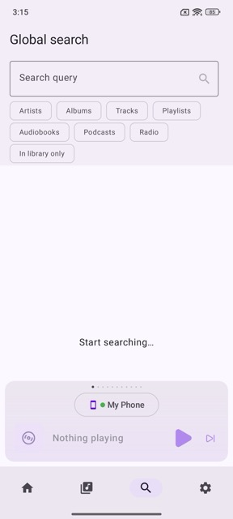
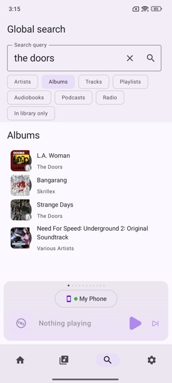
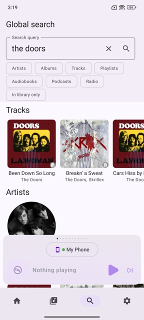

# Global Search

The **Global Search** tab allows you to search beyond your local Music Assistant library. Because Global Search queries all of your configured Music Providers simultaneously, it may take a bit longer than a quick search in you local [library](library.md).

The speed of a global search depends heavily on the performance and rate-limiting policies of your active Music Providers. To deliver your results, the Music Assistant server must make live API calls across all connected services at the same time.

## Triggering a Search

Once you have typed your search query, you can trigger the global search in one of two ways:

- **Apply a Filter:** Select a specific content type filter from the menu. Music Assistant will immediately trigger the search for that specific category. This is usually the best choice for quick results, since this way of searching limits the number of outgoing API calls, returning your results much faster.

- **Search Everything:** Press the magnifying glass / return key on your keyboard to search across all content types simultaneously without filtering.

